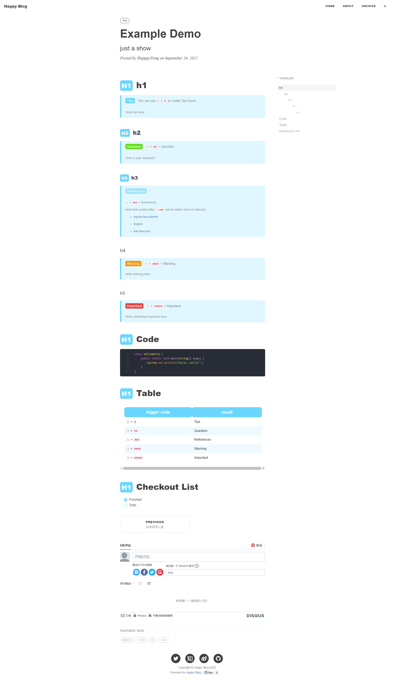

# [Happy Blog](https://blog.leqing.work/)

fork from @[Github Hux Blog](https://github.com/Huxpro/huxpro.github.io)

[Build Blog With Github Page And Jekyll - old version](https://blog.leqing.work/2021/09/14/Build-Blog-With-Github-Page-And-Jekyll/)

css idea inspired by [haru](https://github.com/LSTM-Kirigaya/typora-haru-theme)

# Modify

- increase catalog h1-h6 indent distance

- change css e.g. table

- add css for checkout、h1-h3 ::before

- extend blockquote by `> #*n`

  - `> #` Tips
  - `> ##` Question
  - `> ###` References
  - `> ####` Warning
  - `> #####` Important

- background images

# Example Demo

[click to live demo](http://localhost:4000/2022/09/16/example-demo/)

